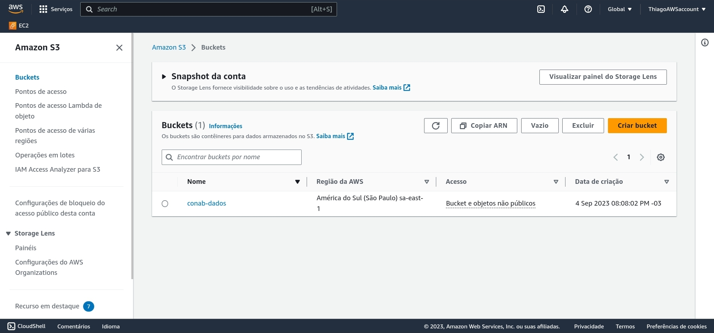
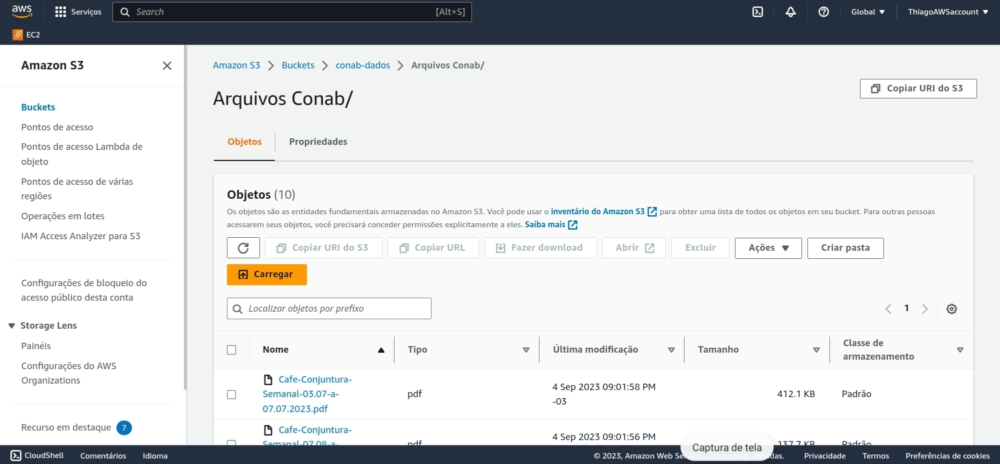
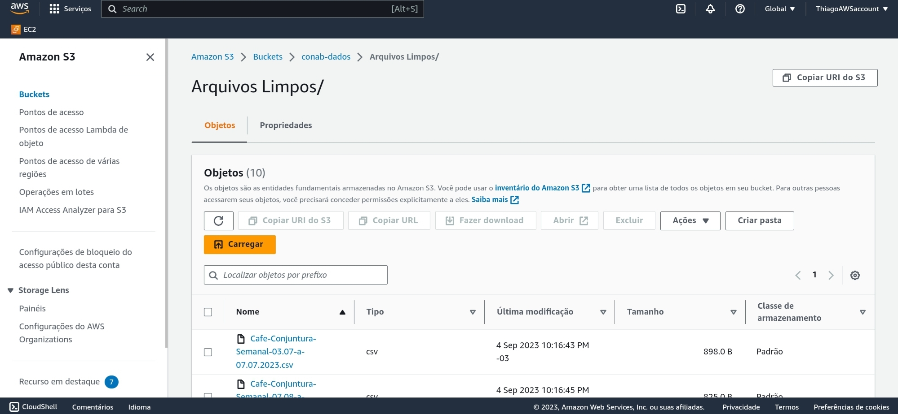

# Projeto_Cafe

## Armazenamento
### Criação de Bucket S3
[AWS_S3_CreateBucket](Code/01.AWS_S3_CreateBucket.ipynb)

Código python para criação de um Bucket S3 na AWS com o nome "conab-dados".

## Inserção de dados
### WebScrapping de dados para popular o S3 criado
[AWS_S3_WebScraping](Code/02.AWS_S3_WebScraping.ipynb)

Código python para realizar um WebScrapping dos dados do café do Conab (Companhia Nacional de Abastecimento), arquivos no formato .pdf de relatórios da produção de café nacional. Posteriormente, realizar a ingestão desses arquivos em formato cru (archive.pdf) para uma pasta "Arquivos Conab/" dentro do Bucket S3 "conab-dados".

## Limpeza de dados
### Transformação dos arquivos
[AWS_S3_Cleaning](Code/03.AWS_S3_Cleaning.ipynb)

Código python para realizar a leitura dos arquivos em formato .pdf da pasta "Arquivos Conab/" do S3 Bucket "conab-dados", buscando dentro do conteúdo  do relatório dados específicos para a análise, sendo eles a data dos dados colhidos em conjunto com uma tabela dos resultados.

Formato do relatório, arquivo em .pdf, providenciado no site do Conab e armazenado na pasta "Arquivos Conab/" do S3 Bucket "conab-dados": 
 [Arquivo_Conab_raw.pdf](Images/Arquivo_Conab_raw.pdf)

Formato do relatório, arquivo em .pdf, apos a limpeza e armazenamento em formato .csv na pasta "Arquivos Limpos/" do S3 Bucket "conab-dados": 
 [Arquivo_Conab_limpos.csv](Images/Arquivos_Conab_limpos.csv)

Após a localização dos dados requisitados, o código realiza o armazenamento do resultado em um dataframe > dicionário > arquivo.csv, para ser baixado em uma pasta "Arquivos Limpos/" dentro do S3 Bucket "conab-dados".

